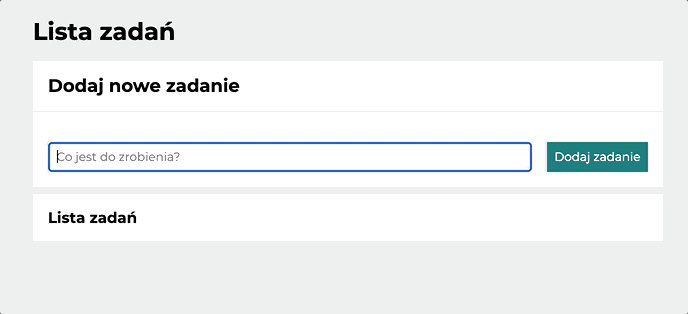
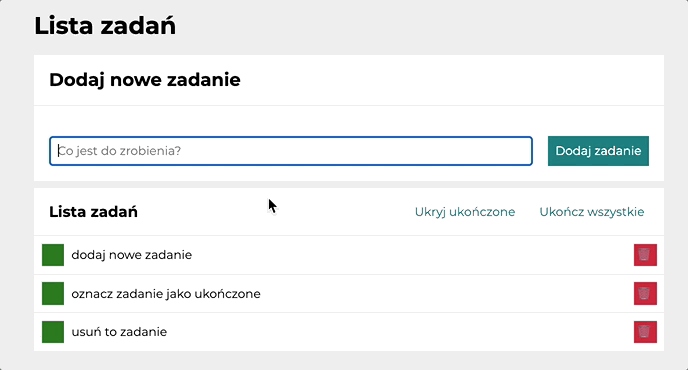
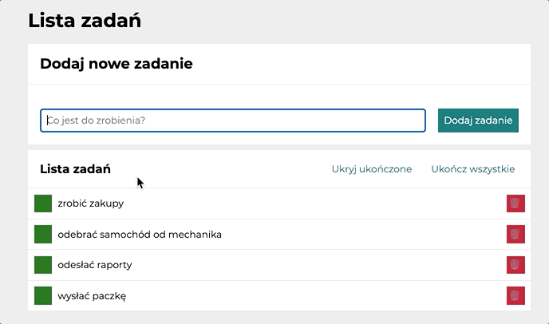

# To Do List

## Table of contents
* [Demo](#demo)
* [General info](#general-info)
* [How it works](#how-it-works)
* [Technologies](#technologies)
* [Setup](#setup)

## Demo
Check it out! ---> https://holaa-olaa.github.io/todo-list/

## General info

A simple application that allows you to convert exchange rates based on constant variables specified in code. It uses functions in JavaScript allowing for quick and accurate calculations. Graphic design using CSS.

Created for the course: YouCode II Frontend Developer

## How it works

1. Enter the job content, then add with the button or press "Enter". The task will be moved to the list below, and the input will be cleared and focus set on it.

2. Use the icons on the right and left of each task to modify the list by marking the selected task as completed or deleting it. Completed task will be crossed out, deleted task will disappear from the list.

3. Use the "Ukryj ukończone" button to hide all completed tasks, then "Pokaż ukończone" to show them again. 
Use the "Ukończ wszystkie" button to mark each task as completed. Once this option is used, the button is disabled from use.

## Technologies
Project is created with:
* HTML
* CSS (BEM naming convetion)
* Grid
* Flex
* ES6+
* Media queries
	
## Setup
To run this project just open the link in your browser. Task list is generated based on information entered by user. User can edit the list by adding new tasks, deleting them or marking as done (with possibility of unmarking).
